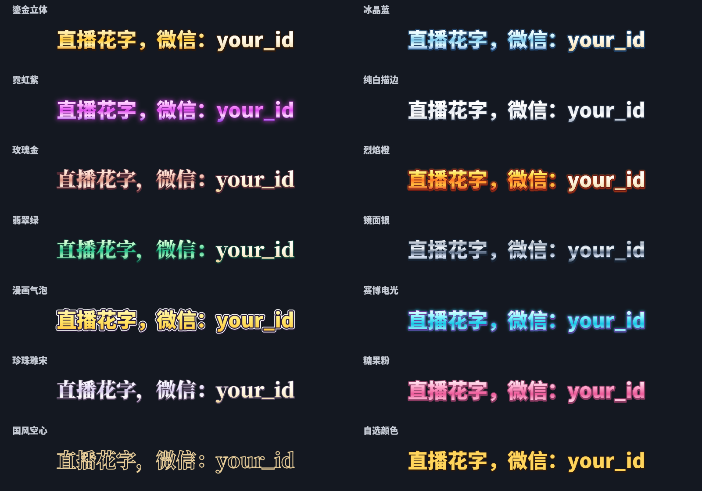

# Typecast Studio

[English](../README.md) · **한국어** · [简体中文](README.zh-CN.md)

**디자인 14종, 글꼴 2종, 애니메이션 10종**을 제공하는 방송용 텍스트 프로그램입니다. 문구 하나를 계속 표시하거나 여러 문구를 한 줄씩 번갈아 표시할 수 있습니다. 도우인 라이브 컴패니언에 출력창을 연결하거나 투명 PNG·GIF·WebP 파일로 저장하세요.

## 다운로드와 설치

**[Windows 설치 파일 다운로드](https://github.com/pingulee/typecast-studio/releases/latest)**

`Typecast-Studio-Setup-1.1.0.exe`를 다운로드해 설치한 뒤 바탕화면의 **Typecast Studio**를 실행하세요. **Node.js·npm·Python·개발 도구를 따로 설치하거나 명령어를 입력할 필요가 없습니다.** 실행 환경과 한글·중국어를 지원하는 글꼴이 포함되어 있으며, 평소 사용 시 인터넷이나 계정도 필요하지 않습니다.

- Windows 10/11 64비트용입니다. 별도 출력창에는 Edge 또는 Chrome을 사용합니다.
- 설치 프로그램의 기본 언어는 **영어**이며 **English / 한국어 / 简体中文**를 선택할 수 있습니다. 마지막 설치 언어를 기억합니다.
- 처음 실행하는 편집기는 설치 시 선택한 언어를 사용합니다. 상단 언어 메뉴에서 언제든 변경하면 자동 저장됩니다. **언어를 변경해도 직접 입력한 문구는 바뀌지 않습니다.**
- 설치 언어 정보가 없으면 영어가 기본입니다. 기존 1.0 설정과 문구도 유지되며, 언어 선택 전까지 영어로 표시됩니다.
- 기본 설치 위치는 `C:\Program Files\Typecast Studio`이며 설치 시 관리자 확인이 필요합니다.
- **Windows 로그인 시 자동 시작**은 기본 선택되어 있고 해제할 수 있습니다. 로그인 시에는 브라우저나 출력창을 띄우지 않고 백그라운드 서비스만 시작합니다.
- 설치 파일은 코드 서명이 없어 Windows에서 게시자 경고가 나올 수 있습니다.

## 도우인 라이브 컴패니언 연결

1. 편집기에서 문구·디자인·애니메이션을 선택합니다.
2. **도우인 라이브 컴패니언 연결**에서 크로마키 배경색을 고르고 **텍스트 출력창 열기**를 누릅니다.
3. 도우인에서 **소스 추가 → 창 (添加素材 → 窗口)**을 선택하고 Typecast Studio 출력창을 추가합니다. 한국어 사용 시 창 제목은 **텍스트 출력 - Typecast Studio**입니다.
4. 해당 소스에 기능이 있으면 **크로마키 (绿幕抠图 / 颜色抠图)**를 켜고 배경색을 지정합니다. 제목 표시줄과 창 테두리도 잘라냅니다.
5. 방송 화면에서 위치와 크기를 맞춥니다. 이후 편집기에서 수정하면 출력창에 자동 반영됩니다.

초록 글자는 파란 배경, 파란 글자는 초록 배경을 권장합니다. 출력창을 최소화하거나 닫지 마세요. 그래픽 장치와 캡처 방식에 따라 백그라운드 창 갱신 동작이 다를 수 있습니다.

도우인 버전에 따라 메뉴와 크로마키 지원이 다릅니다. 창 소스에 크로마키가 없으면 검정 배경을 사용하거나 투명 PNG를 저장해 이미지 소스로 추가하세요. GIF·WebP 직접 추가도 해당 버전의 지원 여부를 확인해야 합니다. 도우인 공식 플러그인이 아니며, 실제 캡처·크로마키 결과는 방송용 PC에서 확인하세요.

[도우인 공식 크로마키 안내](https://streamingtool.douyin.com/docs/guide_ztb12xj7)

## 고정 링크와 실시간 반영

이 프로그램과 방송 프로그램을 **같은 컴퓨터**에서 실행하세요.

| 화면 | 주소 |
| --- | --- |
| 편집기 | `http://localhost:4318` |
| 초록 배경 출력 | `http://localhost:4318/capture?key=green` |
| 파란 배경 출력 | `http://localhost:4318/capture?key=blue` |
| 검정 배경 출력 | `http://localhost:4318/capture?key=black` |
| 투명 웹 출력 | `http://localhost:4318/overlay` |

투명 링크는 웹 소스를 지원하는 방송 프로그램용입니다. 모든 도우인 버전이 임의 웹 링크를 받아들이는 것은 아닙니다. 일반 창 캡처는 웹의 투명도를 보존하지 않으므로 지원되는 경우 크로마키로 배경을 제거합니다. 이 주소는 같은 컴퓨터에서만 작동하며 인터넷 공개 주소가 아닙니다.

## 문구·디자인·애니메이션

- **문구 하나만 입력해도 됩니다.** ‘등장 후 유지’는 한 번 등장한 뒤 계속 표시합니다. 숨쉬기·스크롤은 계속 움직이며, 반복 모드를 선택하면 효과를 반복합니다.
- 여러 문구는 한 번에 하나씩 순서대로 표시합니다. 빈 문구는 건너뛰고 전부 비어 있으면 아무것도 표시하지 않습니다.
- 최대 8개, 하나당 160자까지 지원합니다. 줄바꿈은 공백이 되고 긴 문구는 한 줄에 맞게 자동 축소됩니다.
- 효과: 위·아래·옆 슬라이드, 페이드, 팝업 확대, 펼쳐 보이기, 타자 효과, 숨쉬기, 흐르는 스크롤, 바로 표시.
- 디자인: 입체 골드, 아이스 블루, 네온 퍼플, 화이트 테두리, 로즈 골드, 불꽃 오렌지, 비취 그린, 미러 실버, 만화 팝, 사이버 글로우, 펄 세리프, 캔디 핑크, 클래식 윤곽선, 직접 고른 색.
- 글꼴·크기·테두리·입체 깊이·빛 번짐·정렬·시간·연락처 강조를 조절할 수 있습니다.



## 저장·내보내기·종료

입력을 마치고 약 0.6초 뒤 자동 저장·동기화합니다. 언어를 포함한 설정은 `%LOCALAPPDATA%\Typecast Studio\settings.json`에 보관하며 Program Files에 설정을 쓰지 않습니다. 출력창은 평소 브라우저 계정과 분리된 자체 프로필을 사용합니다.

투명 PNG·움직이는 GIF·움직이는 WebP를 저장할 수 있습니다. WebP는 반투명 가장자리를 보존하고 GIF는 투명/불투명만 지원해 빛 번짐·페이드 가장자리가 거칠 수 있습니다. 단일 문구 유지 모드는 한 번만 등장하는 파일로 저장하고 숨쉬기·스크롤·반복 모드는 반복 재생합니다. PNG는 현재 문구 전체를 저장합니다. 미리 보기 체크무늬는 파일에 들어가지 않습니다.

편집기 탭을 닫아도 백그라운드는 계속 실행합니다. **시작 메뉴 → Typecast Studio → 백그라운드 서비스 종료**로 끝내세요. 자동 시작은 **Windows 설정 → 앱 → 시작 프로그램**에서 끌 수 있습니다. 앱 제거는 프로그램·바로가기·자동 시작 등록을 삭제하되 재설치를 위해 AppData의 문구와 브라우저 프로필은 남겨둡니다.

업데이트 시 이전 백그라운드를 종료하고 새 EXE를 설치하세요. 4318 포트가 사용 중이면 구버전을 먼저 종료하세요. 포터블 버전에서 옮길 때는 양쪽을 종료한 뒤 기존 `data/settings.json`을 위 AppData 경로로 복사하세요. 새로 추가된 설정은 기본값으로 보완됩니다.

## 개발자용 안내

일반 사용자는 설치 파일만 있으면 됩니다. 소스 빌드는 Node.js 24를 사용합니다.

```sh
npm ci
npm run check
npm run lint
npm test
npm run test:render
npm run build
npm start
```

`npm start`만 실제 로컬 서버를 시작합니다. build/check/test는 네트워크 포트를 열지 않습니다. React·Vite·Canvas·로컬 Node HTTP/SSE를 사용합니다.

설치 파일을 빌드하려면 NSIS의 `makensis`를 PATH에 추가하거나 `MAKENSIS` 환경 변수로 지정하고, 빌드 후 `npm run package:windows`를 실행하세요. 공식 Node.js 24.19.0 Windows x64 파일을 다운로드하고 SHA-256을 검증합니다. 기존 파일은 `TYPECAST_NODE_EXE`로 지정할 수 있으며 검증은 동일하게 적용됩니다. 결과는 `dist/`에 생성됩니다.

GitHub Actions에서 세 언어의 Windows 설치·언어 저장·자동 시작 등록·실행·설정 변경·재시작·제거를 검사합니다. API/SSE 저장, 번역 누락, Canvas 렌더링, GIF/WebP 생성도 검사합니다. 실제 도우인 캡처는 자동 검사에 포함되지 않습니다. WebMCP는 지원 브라우저에서만 선택적으로 등록합니다.

소스는 MIT, Noto Sans CJK·Noto Serif CJK 글꼴은 SIL OFL입니다. 글꼴 라이선스는 `public/fonts/`에 있고 설치 파일에는 의존성 라이선스 안내가 포함됩니다. 사용자 설정·브라우저 프로필·실행 파일 캐시·빌드 결과는 소스 저장소에 올리지 않습니다.
